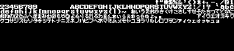

# rust-nes-sprites2png

convert nes file sprites to png by rust

## Screenshot



## Usage

```rust
cargo run "sample/hello_world.nes" "sample/hello_world.png"
```

## Testing

```rust
cargo test
```